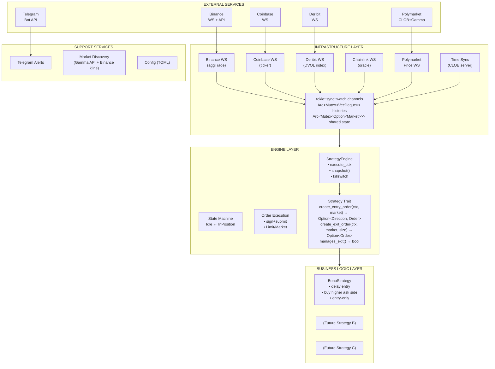
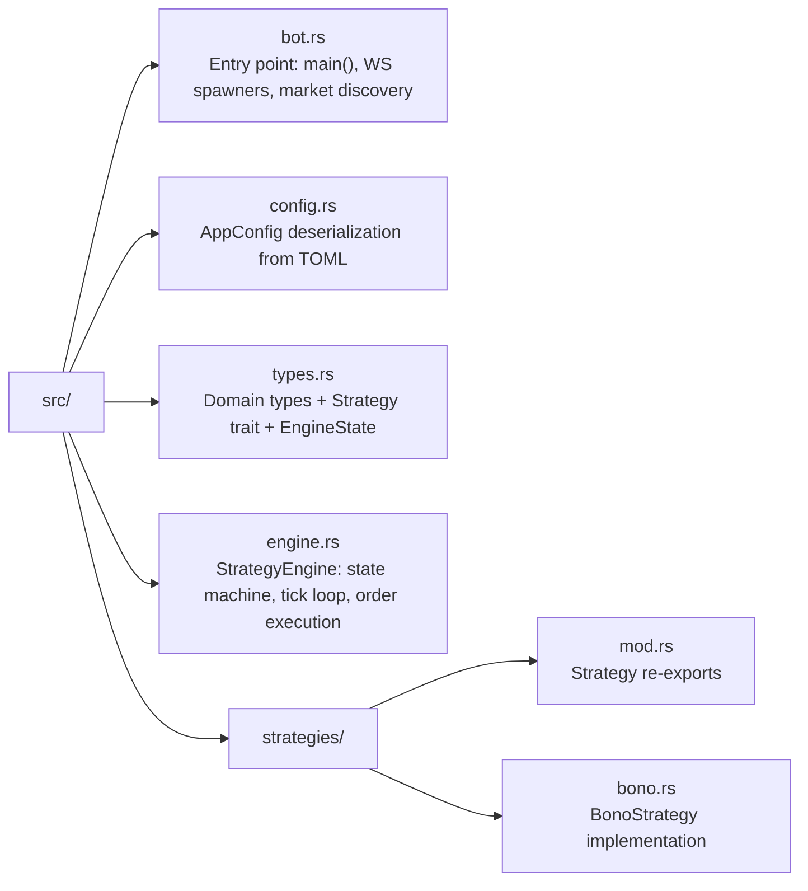
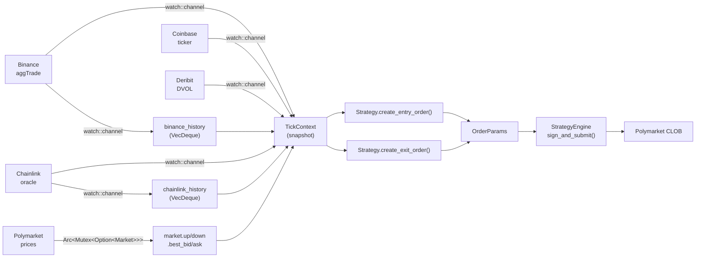

# Architecture

## Overview

Serekes is a Rust trading bot that trades binary Up/Down prediction markets on Polymarket, using real-time price data from multiple exchanges to inform trading decisions. It follows a **separation of business logic from infrastructure** — strategies contain only trading decisions, while the engine handles all I/O, state management, and order execution.

## Architecture Diagram

## Module Structure

## Layer Responsibilities

### Infrastructure Layer (`bot.rs`)

- WebSocket lifecycle management (connect, reconnect, backoff)
- Data feed parsing (Binance aggTrade, Coinbase ticker, Deribit DVOL, Chainlink oracle)
- Price history buffering (ring buffers via VecDeque)
- Data broadcast via `tokio::sync::watch` channels
- Market discovery via Polymarket Gamma API
- Binance kline API for strike price
- Time synchronization with Polymarket server
- Graceful shutdown (SIGINT/SIGTERM)

### Engine Layer (`engine.rs`, types in `types.rs`)

- Tick-based execution loop
- State machine (Idle ↔ InPosition)
- TickContext snapshot construction from all feeds
- Killswitch: halts entries when Binance/Coinbase prices diverge beyond threshold
- Order signing and submission via Polymarket SDK (tick size + neg_risk auto-handled by SDK)
- Minimum order size validation before submission
- Order response status handling (Matched/Delayed/Unmatched/Live)
- Limit and Market order support
- Position tracking (token ID, direction, entry price, size)
- Periodic status logging
- Telegram trade alerts

### Business Logic Layer (`strategies/`)

- Pure trading logic — no I/O, no async, no infrastructure
- Receives `TickContext` (read-only market snapshot) and `Market` (Polymarket state)
- Returns `Option<OrderParams>` — the engine handles everything else
- Pluggable via the `Strategy` trait

### Support Services

- **Config** (`config.rs`): TOML deserialization with defaults and validation
- **Telegram** (`telegram.rs`): Non-blocking alert sender via `OnceLock` + `tokio::spawn`
- **Types** (`types.rs`): Shared domain types (`Market`, `TokenSide`, `TokenDirection`, `Strategy` trait, `EngineState`)

## Concurrency Model

The bot uses **Tokio** for async concurrency:

- **4 long-lived WS tasks** — each spawned via `tokio::spawn`, run independently with auto-reconnect
- **1 per-market WS task** — spawned for each active market, aborted on market expiry
- **Main task** — runs the market rotation loop synchronously (discover → tick → cleanup → repeat)
- **Communication** — `watch` channels for latest-value feeds, `Arc<Mutex<>>` for shared mutable state

No thread pool tuning needed — all I/O is async, compute is minimal.

## Data Flow

## Key Design Decisions

1. **Strategy/Engine separation** — Strategies are pure functions of `(TickContext, Market) → Option<Order>`. They never touch I/O, WebSockets, or SDK internals. This makes them trivially testable and interchangeable.

2. **Watch channels for price feeds** — `tokio::sync::watch` provides latest-value semantics, ideal for price feeds where only the most recent value matters. No backpressure concerns.

3. **Dual strike price** — Both Binance kline open price and Chainlink oracle price are fetched for each market. Chainlink is used as the authoritative strike (it's the settlement oracle).

4. **Killswitch on exchange divergence** — If Binance and Coinbase prices diverge beyond a configurable threshold, all new entries are blocked. This protects against feed issues or flash crashes.

5. **Market rotation** — The bot automatically discovers and rotates to new markets as they open, running continuously across market boundaries.

6. **Entry-only vs full-cycle strategies** — The `manages_exit()` flag lets strategies opt out of exit logic. Entry-only strategies (like Bono) place a buy and immediately yield control back to the rotation loop.

## External Dependencies

| Crate | Purpose |
|-------|---------|
| `polymarket-client-sdk` | CLOB client, WS price streams, Gamma API, order signing |
| `tokio` | Async runtime, channels, signals |
| `tokio-tungstenite` | WebSocket connections (Binance, Coinbase, Deribit, Chainlink) |
| `reqwest` | HTTP client (Binance klines, Telegram) |
| `alloy-signer-local` | Polygon wallet signing |
| `k256` | Secp256k1 cryptography |
| `serde` / `toml` | Config deserialization |
| `chrono` | Timestamp handling |
