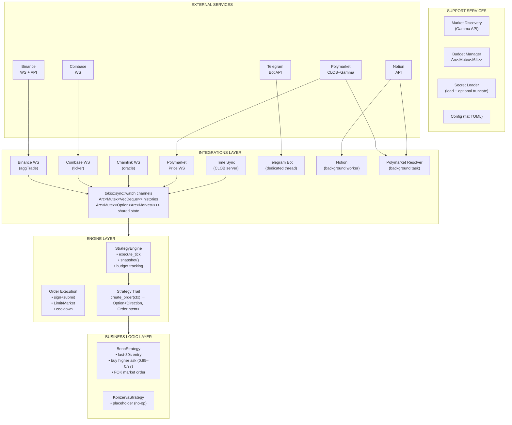
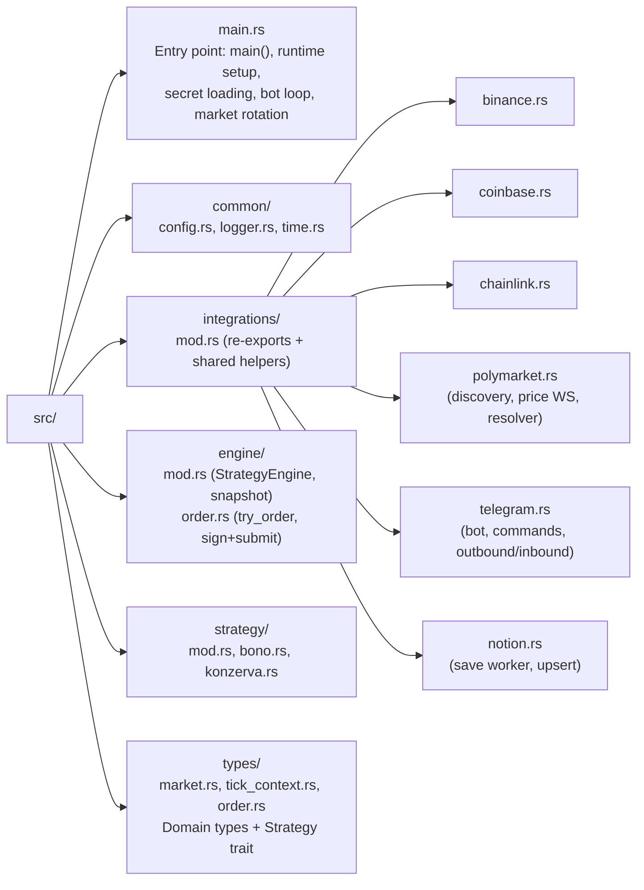
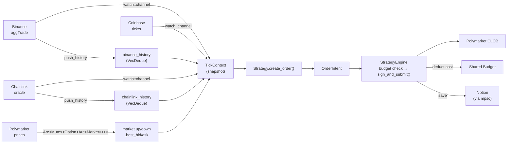

# Architecture

## Overview

Serekes is a Rust trading bot that trades binary Up/Down prediction markets on Polymarket, using real-time price data from multiple exchanges to inform trading decisions. It follows a **separation of business logic from infrastructure** — strategies contain only trading decisions, while the engine handles all I/O, state management, and order execution.

## Architecture Diagram

## Module Structure

## Layer Responsibilities

### Integrations Layer (`integrations/`)

- **Binance** (`binance.rs`): aggTrade WebSocket, price history buffering
- **Coinbase** (`coinbase.rs`): ticker WebSocket
- **Chainlink** (`chainlink.rs`): Polymarket live-data WS, oracle price history
- **Polymarket** (`polymarket.rs`): market discovery (Gamma API), per-market price WS, strike price resolution, background market resolver
- **Telegram** (`telegram.rs`): dedicated OS thread with own tokio runtime, outbound message queue with retry, inbound long-polling with owner-only filtering, command registration and routing
- **Notion** (`notion.rs`): background save worker via mpsc channel, upsert by Name, auto-populates created/updated dates and market URL

Shared helpers in `mod.rs`: exponential backoff, price history push, JSON parsing.

### Infrastructure (`main.rs` + `common/`)

- Configurable tokio runtime (`bot_worker_threads`, default 2)
- Secret loading at startup from `secrets.toml` (polygon private key, telegram bot token, notion secret)
  - `truncate_secrets_file` controls whether the file is emptied after reading
  - Missing telegram token → error + exit
  - Missing private key → PAPER mode
- Time synchronization with Polymarket server
- Configurable tick rate (`bot_engine_ticks_per_second`, converted to microsecond sleep interval)
- Graceful shutdown (SIGINT/SIGTERM)

### Engine Layer (`engine/`, types in `types/`)

- TickContext snapshot construction from all feeds
- Budget management: shared `Arc<Mutex<f64>>`, deducted on buy, checked before orders
- Order signing and submission via Polymarket SDK (tick size + neg_risk auto-handled by SDK)
- Minimum order size validation (Market: ≥ 1 USDC, Limit: ≥ `market.min_order_size`)
- Failed order cooldown (3s after last failure)
- Order response status handling (Matched/Delayed/Unmatched/Live) — stored in `Trade.order_status`
- Fill price resolution from CLOB response (`making_amount` / `taking_amount` for matched market orders)
- Limit and Market order support
- Completion detection (budget < $1.00)

### Business Logic Layer (`strategy/`)

- Pure trading logic — no I/O, no async, no infrastructure
- Receives `TickContext` (read-only market snapshot including trade history)
- Returns `Option<(TokenDirection, OrderIntent)>` — the engine handles everything else
- Pluggable via the `Strategy` trait

### Support Services

- **Config** (`common/config.rs`): Flat TOML deserialization with defaults and validation. All keys are prefixed by their module (`bot_`, `market_`, `engine_`, `logger_`, `feeds_`, `notion_`). Security keys (`secrets_file`, `truncate_secrets_file`) have no prefix.
- **Logger** (`common/logger.rs`): Always shows timestamp, bot name, module path, colored level, and message.
- **Time** (`common/time.rs`): Server-synced `now_ms()` with Polymarket offset
- **Types** (`types/`): Shared domain types (`Market`, `TickContext`, `TokenDirection`, `OrderIntent`, `Trade`, `Strategy` trait)
- **Budget**: `Arc<Mutex<f64>>` shared between engine and Telegram commands — queryable/settable at runtime

## Concurrency Model

The bot uses **Tokio** with a configurable multi-threaded runtime:

- **Runtime** — `bot_worker_threads` configurable (default 2). Tunable for CPU vs throughput tradeoff.
- **3 long-lived WS tasks** — each spawned via `tokio::spawn`, run independently with auto-reconnect
- **1 per-market WS task** — spawned for each active market, aborted on market expiry
- **Main task** — runs the market rotation loop synchronously (discover → tick → cleanup → repeat)
- **Tick loop** — sleeps `1_000_000 / bot_engine_ticks_per_second` microseconds between ticks. Default 1000 ticks/sec (1ms).
- **Telegram thread** — dedicated OS thread with single-threaded tokio runtime, fully isolated from the engine runtime. Runs outbound message queue and inbound command polling concurrently.
- **Notion worker** — tokio task processing save requests from an mpsc channel. Non-blocking from the caller's perspective.
- **Polymarket resolver** — background tokio task that periodically checks completed markets for resolution via the Gamma API, updating Notion records.
- **Communication** — `watch` channels for latest-value feeds, `Arc<Mutex<>>` for shared mutable state (market, budget), `mpsc` for Telegram/Notion message queues

## Data Flow

## Key Design Decisions

1. **Strategy/Engine separation** — Strategies are pure functions of `TickContext → Option<(Direction, OrderIntent)>`. They never touch I/O, WebSockets, or SDK internals. This makes them trivially testable and interchangeable.

2. **Watch channels for price feeds** — `tokio::sync::watch` provides latest-value semantics, ideal for price feeds where only the most recent value matters. No backpressure concerns.

3. **Dual strike price** — Both Binance history and Chainlink oracle price are looked up from history buffers for each market. Chainlink uses exact timestamp match (it's the settlement oracle); Binance uses latest price at or before market start.

4. **Budget tracking** — Shared `Arc<Mutex<f64>>` budget is deducted on each buy trade and checked before order placement. When budget drops below $1.00, the engine stops trading. Budget is queryable and settable at runtime via Telegram.

5. **Market rotation** — The bot automatically discovers and rotates to new markets as they open, running continuously across market boundaries. Per-market state (trades, cooldowns) is cleared between rotations.

6. **Telegram isolation** — The Telegram bot runs on a dedicated OS thread with its own single-threaded tokio runtime, preventing any Telegram latency or errors from affecting the trading engine. Only messages from the configured `bot_telegram_chat_id` are processed.

7. **Failed order cooldown** — After a CLOB submission failure, the engine waits 3 seconds before attempting another order, preventing rapid-fire failures.

8. **Secret file truncation** — By default (`truncate_secrets_file = true`), the secrets file is emptied after reading at startup, so secrets do not remain on disk. All secrets (polygon key, telegram token, notion secret) are stored in a single `secrets.toml` file.

9. **Flat config** — All configuration lives in a single flat TOML file with no nested sections. Keys are prefixed by their module (`bot_`, `market_`, `engine_`, `logger_`, `feeds_`, `notion_`), making it easy to grep and manage.

10. **Unified integrations module** — All external service integrations (Binance, Coinbase, Chainlink, Polymarket, Telegram, Notion) live under a single `integrations/` module, keeping the top-level module structure clean.

11. **Non-blocking Notion saves** — Notion API calls are queued via mpsc and processed by a background worker, so the trading engine is never blocked by network latency.

12. **Polymarket resolver** — A background task periodically queries the Gamma API for completed market resolutions, automatically updating Notion records from "completed" to "resolved" with the winning outcome.

## External Dependencies

| Crate | Purpose |
|-------|---------|
| `polymarket-client-sdk` | CLOB client, WS price streams, Gamma API, order signing |
| `tokio` | Async runtime, channels, signals |
| `tokio-tungstenite` | WebSocket connections (Binance, Coinbase, Chainlink) |
| `teloxide` | Telegram Bot API client (long-polling, message sending, command menu) |
| `reqwest` | HTTP client (Telegram via teloxide, Notion API, Gamma API) |
| `alloy-signer-local` | Polygon wallet signing |
| `k256` | Secp256k1 cryptography |
| `serde` / `toml` | Config deserialization |
