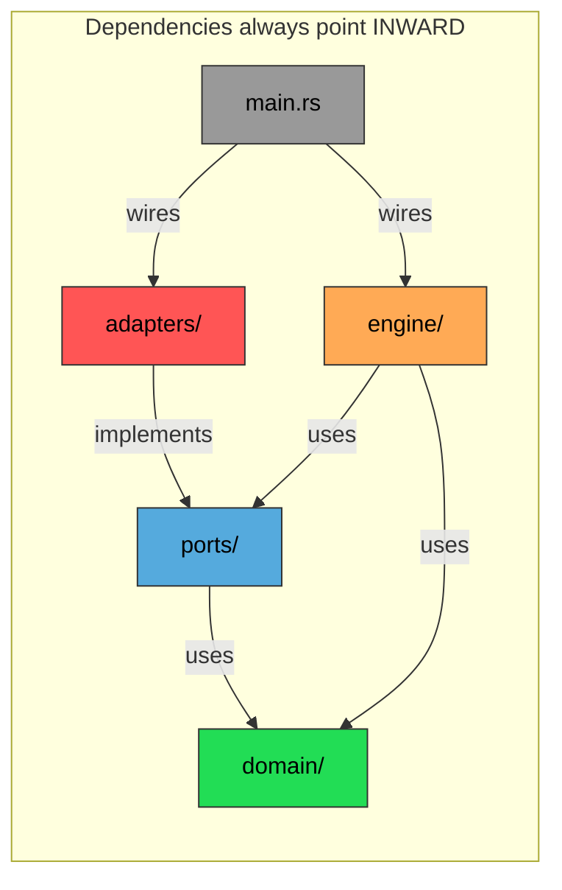
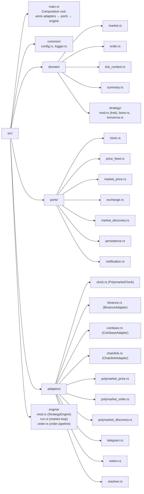

# Architecture

## Overview

Serekes is a Rust trading bot that trades binary Up/Down prediction markets on Polymarket, using real-time price data from multiple exchanges to inform trading decisions. It follows **Hexagonal Architecture (ports & adapters)** — the core domain and engine depend only on trait-based port interfaces, while all external services are encapsulated in adapter implementations. Strategies contain only trading decisions (pure functions), and all I/O is handled by adapters injected at startup.

## Architecture Diagram

```mermaid
graph TB
    subgraph DRIVING["DRIVING ADAPTERS (Left Side)"]
        TEL_IN["Telegram Commands<br/>(Inbound Adapter)"]
    end

    subgraph HEXAGON["CORE HEXAGON"]
        subgraph PORTS_IN["Inbound Ports"]
            P_CMD["bot_budget_command()"]
        end

        subgraph APP["Application Service"]
            ENGINE["StrategyEngine<br/>• execute_tick<br/>• snapshot<br/>• resolve_strike_prices<br/>• trade_market / run"]
        end

        subgraph DOMAIN["Domain Model"]
            MARKET["Market"]
            ORDER["OrderIntent / Trade"]
            TICK["TickContext"]
            SUMMARY["MarketSummary"]
            STRAT_TRAIT["Strategy trait"]
            BONO["BonoStrategy"]
            KONZ["KonzervaStrategy"]
        end

        subgraph PORTS_OUT["Outbound Ports (traits)"]
            P_FEED["PriceFeedPort"]
            P_MPRICE["MarketPricePort"]
            P_EXCHANGE["ExchangePort"]
            P_DISCOVERY["MarketDiscoveryPort"]
            P_PERSIST["PersistencePort"]
            P_NOTIFY["NotificationPort"]
            P_CLOCK["ClockPort"]
        end
    end

    subgraph DRIVEN["DRIVEN ADAPTERS (Right Side)"]
        A_BIN["BinanceAdapter"]
        A_CB["CoinbaseAdapter"]
        A_CL["ChainlinkAdapter"]
        A_PP["PolymarketPriceAdapter"]
        A_PO["PolymarketOrderAdapter"]
        A_PD["GammaDiscoveryAdapter"]
        A_TG["TelegramAdapter"]
        A_NOT["NotionAdapter"]
        A_CLK["PolymarketClock"]
        A_RES["Resolver"]
    end

    subgraph EXT["EXTERNAL SERVICES"]
        E_BIN["Binance WS"]
        E_CB["Coinbase WS"]
        E_CL["Chainlink WS"]
        E_PM["Polymarket CLOB+Gamma"]
        E_TG["Telegram Bot API"]
        E_NOTION["Notion API"]
    end

    TEL_IN --> P_CMD --> ENGINE
    ENGINE --> STRAT_TRAIT --> BONO & KONZ
    ENGINE --> MARKET & ORDER & TICK & SUMMARY

    ENGINE --> P_FEED & P_MPRICE & P_EXCHANGE & P_DISCOVERY & P_PERSIST & P_CLOCK

    P_FEED --> A_BIN & A_CB & A_CL
    P_MPRICE --> A_PP
    P_EXCHANGE --> A_PO
    P_DISCOVERY --> A_PD
    P_PERSIST --> A_NOT
    P_NOTIFY --> A_TG
    P_CLOCK --> A_CLK

    A_BIN --> E_BIN
    A_CB --> E_CB
    A_CL --> E_CL
    A_PP & A_PO & A_PD --> E_PM
    A_TG --> E_TG
    A_NOT & A_RES --> E_NOTION
    A_RES --> E_PM
```



## Dependency Rule



**The golden rule**: `domain/` and `ports/` NEVER import from `adapters/` or `engine/`. Dependencies always point inward toward the domain.

## Module Structure



## Layer Responsibilities

### main.rs (Composition Root)

- Loads config and secrets, initializes logger
- Builds tokio runtime
- Creates all adapters (clock, price feeds, exchange, discovery, persistence, notifications)
- Injects adapters into `StrategyEngine` via port traits
- Calls `engine.run()`, handles graceful shutdown (SIGINT/SIGTERM)
- Contains the Telegram `/budget` command handler (inbound adapter glue)

### Domain Layer (`domain/`)

Pure domain model with **zero infrastructure dependencies**:

- **Market** (`market.rs`): Binary market metadata + domain rules (slug construction, time bucketing, PnL computation). Time methods take `now_ms` parameter — no global state.
- **TickContext** (`tick_context.rs`): Read-only snapshot of all feeds passed to strategy each tick. Pure data — no channels, no mutexes.
- **OrderIntent / Trade** (`order.rs`): Strategy's order decision (Limit or Market) and executed trade record.
- **MarketSummary** (`summary.rs`): Summary of a completed market session.
- **Strategy trait** (`strategy/mod.rs`): `create_order(ctx) → Option<(Direction, OrderIntent)>` — pure decision function.
- **BonoStrategy** (`strategy/bono.rs`): Entry-only strategy, buys higher ask within 200s of expiry.
- **KonzervaStrategy** (`strategy/konzerva.rs`): Placeholder no-op strategy.

### Ports Layer (`ports/`)

Trait definitions that form the boundary between the core and the outside world:

| Port | Trait | Methods |
|------|-------|---------|
| Clock | `ClockPort` | `now_ms()` |
| Price Feed | `PriceFeedPort` | `latest()`, `is_ready()`, `lookup_history()` |
| Market Price | `MarketPricePort` | `connect()`, `current_market()`, `disconnect()` |
| Exchange | `ExchangePort` | `submit_order()`, `is_paper_mode()` |
| Market Discovery | `MarketDiscoveryPort` | `discover()` |
| Persistence | `PersistencePort` | `save()` |
| Notification | `NotificationPort` | `send()` |

### Engine Layer (`engine/`)

Application service that orchestrates trading using **only port traits**:

- `mod.rs`: `StrategyEngine` struct holding `Arc<dyn Port>` references, snapshot construction, strike resolution, tick execution
- `run.rs`: Market rotation loop (discover → resolve → trade → cleanup), tick loop, feed readiness wait
- `order.rs`: Order placement pipeline (budget check → min size → cooldown → exchange port → fill resolution)

All engine fields are private — the only public API is `new()` and `run()`.

### Adapters Layer (`adapters/`)

Concrete implementations of port traits, containing all infrastructure details:

- **PolymarketClock** (`clock.rs`): Server-synced time via Polymarket CLOB. Implements `ClockPort`.
- **BinanceAdapter** (`binance.rs`): aggTrade WebSocket + price history. Implements `PriceFeedPort`.
- **CoinbaseAdapter** (`coinbase.rs`): ticker WebSocket. Implements `PriceFeedPort`.
- **ChainlinkAdapter** (`chainlink.rs`): Polymarket live-data WS + oracle history. Implements `PriceFeedPort`.
- **PolymarketPriceAdapter** (`polymarket_price.rs`): Per-market bid/ask WS. Implements `MarketPricePort`.
- **PolymarketOrderAdapter** (`polymarket_order.rs`): SDK auth + order signing + CLOB submission. Implements `ExchangePort`.
- **GammaDiscoveryAdapter** (`polymarket_discovery.rs`): Gamma API market discovery. Implements `MarketDiscoveryPort`.
- **NotionAdapter** (`notion.rs`): Non-blocking save via mpsc worker. Implements `PersistencePort`.
- **TelegramAdapter** (`telegram.rs`): Dedicated OS thread, command routing, outbound queue. Implements `NotificationPort`.
- **Resolver** (`resolver.rs`): Background task polling for market resolutions via Gamma API.

### Support Services (`common/`)

- **Config** (`config.rs`): Flat TOML deserialization with defaults and validation
- **Logger** (`logger.rs`): Timestamp + bot name + module path + colored level + message

## Concurrency Model

The bot uses **Tokio** with a configurable multi-threaded runtime:

- **Runtime** — `bot_worker_threads` configurable (default 2). Tunable for CPU vs throughput tradeoff.
- **3 long-lived WS tasks** — each spawned via `tokio::spawn`, run independently with auto-reconnect
- **1 per-market WS task** — spawned for each active market, aborted on market expiry
- **Main task** — runs `engine.run()` which owns the market rotation loop (discover → tick → cleanup → repeat)
- **Tick loop** — sleeps `1_000_000 / bot_engine_ticks_per_second` microseconds between ticks. Default 1000 ticks/sec (1ms).
- **Telegram thread** — dedicated OS thread with single-threaded tokio runtime, fully isolated from the engine runtime. Runs outbound message queue and inbound command polling concurrently.
- **Notion worker** — tokio task processing save requests from an mpsc channel. Non-blocking from the caller's perspective.
- **Polymarket resolver** — background tokio task that periodically checks completed markets for resolution via the Gamma API, updating Notion records.
- **Communication** — `watch` channels for latest-value feeds (inside adapters), `Arc<Mutex<>>` for shared mutable state (market, budget), `mpsc` for Telegram/Notion message queues

## Data Flow

```mermaid
flowchart LR
    BIN["BinanceAdapter<br/>(PriceFeedPort)"] -->|latest()| TC["TickContext<br/>(snapshot)"]
    CB["CoinbaseAdapter<br/>(PriceFeedPort)"] -->|latest()| TC
    CL["ChainlinkAdapter<br/>(PriceFeedPort)"] -->|latest()| TC
    PM["PolymarketPriceAdapter<br/>(MarketPricePort)"] -->|current_market()| TC

    TC --> ENTRY["Strategy.create_order()"]
    ENTRY --> OI["OrderIntent"]
    OI --> SE["StrategyEngine<br/>budget check"]
    SE -->|submit_order()| EX["PolymarketOrderAdapter<br/>(ExchangePort)"]
    EX --> CLOB["Polymarket CLOB"]
    SE -->|deduct cost| BUDGET["Shared Budget"]
    SE -->|save()| NOT["NotionAdapter<br/>(PersistencePort)"]
```

## Key Design Decisions

1. **Hexagonal Architecture** — All external dependencies are behind port traits. The engine and domain have zero direct dependencies on WebSocket libraries, HTTP clients, or SDKs. Adapters can be swapped, mocked, or tested independently.

2. **Strategy/Engine separation** — Strategies are pure functions of `TickContext → Option<(Direction, OrderIntent)>`. They never touch I/O, WebSockets, or SDK internals. This makes them trivially testable and interchangeable.

3. **Port-based price feeds** — `PriceFeedPort` provides `latest()`, `is_ready()`, and optional `lookup_history()`. The engine doesn't know whether data comes from WebSockets, REST APIs, or mock data.

4. **ClockPort abstraction** — All time access goes through `ClockPort`, making the entire system testable with mock clocks. Domain types like `Market.time_to_expire_ms()` take `now_ms` as a parameter instead of calling global state.

5. **Composition Root pattern** — `main.rs` is the only place that knows about concrete adapter types. It creates all adapters, injects them into the engine, and starts the system. No other module imports from `adapters/`.

6. **Watch channels inside adapters** — `tokio::sync::watch` for latest-value semantics is an implementation detail of price feed adapters, not exposed to the engine.

7. **Dual strike price** — Both Binance history and Chainlink oracle price are looked up via `PriceFeedPort.lookup_history()`. The engine decides match semantics per source: Chainlink uses exact timestamp match; Binance uses latest-at-or-before.

8. **Budget tracking** — Shared `Arc<Mutex<f64>>` budget is deducted on each buy trade and checked before order placement. When budget drops below $1.00, the engine stops trading. Budget is queryable and settable at runtime via Telegram.

9. **Market rotation** — The engine automatically discovers and rotates to new markets as they open via `engine.run()`, running continuously across market boundaries. Per-market state (trades, cooldowns) is cleared between rotations.

10. **Telegram isolation** — The Telegram bot runs on a dedicated OS thread with its own single-threaded tokio runtime, preventing any Telegram latency or errors from affecting the trading engine.

11. **Failed order cooldown** — After a CLOB submission failure, the engine waits 3 seconds before attempting another order, preventing rapid-fire failures.

12. **Secret file truncation** — By default, the secrets file is emptied after reading at startup.

13. **Flat config** — All configuration lives in a single flat TOML file with prefixed keys (`bot_`, `market_`, `engine_`, `logger_`, `feeds_`, `notion_`).

14. **Non-blocking Notion saves** — Notion API calls are queued via mpsc and processed by a background worker, so the trading engine is never blocked.

15. **Private engine fields** — All `StrategyEngine` fields are private. The public API is two methods: `new()` and `run()`. Internal concerns are fully encapsulated.

## External Dependencies

| Crate | Purpose |
|-------|---------|
| `polymarket-client-sdk` | CLOB client, WS price streams, Gamma API, order signing |
| `tokio` | Async runtime, channels, signals |
| `tokio-tungstenite` | WebSocket connections (Binance, Coinbase, Chainlink) |
| `async-trait` | Async methods in port trait objects |
| `teloxide` | Telegram Bot API client (long-polling, message sending, command menu) |
| `reqwest` | HTTP client (Telegram via teloxide, Notion API, Gamma API) |
| `alloy-signer-local` | Polygon wallet signing |
| `serde` / `toml` | Config deserialization |
