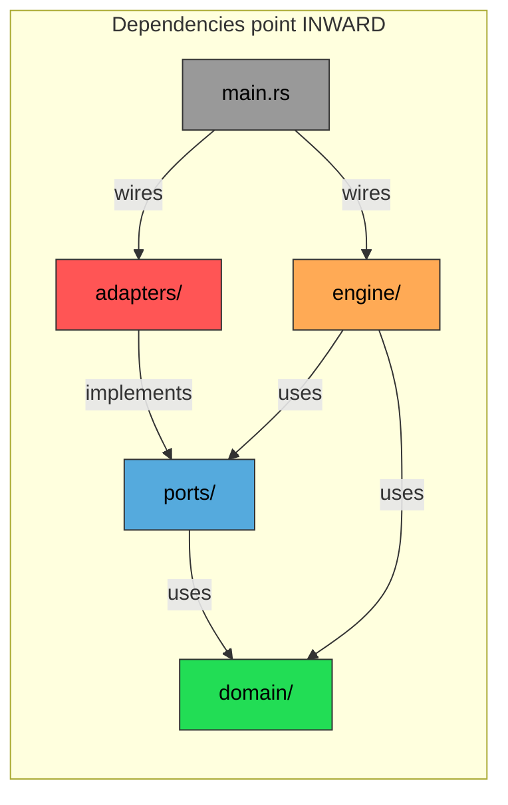

# Hexagonal Architecture Refactoring Plan

## Current State Analysis

The codebase already has some good separation (strategies are pure, types are domain-focused), but several areas violate Hexagonal Architecture principles:

| Problem | Where | Why it matters |
|---------|-------|----------------|
| No port traits for external services | `integrations/` | Engine depends on concrete WebSocket implementations, not abstractions |
| Engine holds infrastructure details | `engine/mod.rs` | `watch::Receiver`, `Arc<Mutex<VecDeque>>` are adapter details leaked into the core |
| Order signing lives in engine | `engine/order.rs` | SDK/signing is infrastructure, but it's inside the core domain loop |
| Notification is a concrete dependency | `main.rs` | Telegram is passed around as a concrete type, not a notification port |
| Persistence is a concrete dependency | `main.rs` | Notion is used directly, not through a persistence port |
| Market discovery in integration | `integrations/polymarket/discovery.rs` | Discovery logic mixes domain rules (slug generation) with HTTP calls |
| `main.rs` wires everything but also contains business logic | `main.rs` | `bot_budget_command()` handler lives in main |

## Proposed Architecture

```mermaid
graph TB
    subgraph "Driving Adapters (Left Side)"
        TEL_IN[Telegram Commands<br/>Inbound Adapter]
    end

    subgraph "Core Domain (Hexagon)"
        subgraph "Ports - Inbound"
            P_CMD[CommandPort<br/>trait]
        end

        subgraph "Application Services"
            ENGINE[TradingEngine<br/>Orchestration]
        end

        subgraph "Domain Model"
            MARKET[Market]
            ORDER[OrderIntent / Trade]
            TICK[TickContext]
            STRAT[Strategy trait]
            BONO[BonoStrategy]
            KONZ[KonzervaStrategy]
        end

        subgraph "Ports - Outbound"
            P_FEED[PriceFeedPort<br/>trait]
            P_EXCHANGE[ExchangePort<br/>trait]
            P_NOTIFY[NotificationPort<br/>trait]
            P_PERSIST[PersistencePort<br/>trait]
            P_DISCOVERY[MarketDiscoveryPort<br/>trait]
            P_CLOCK[ClockPort<br/>trait]
        end
    end

    subgraph "Driven Adapters (Right Side)"
        A_BINANCE[BinanceAdapter]
        A_COINBASE[CoinbaseAdapter]
        A_CHAINLINK[ChainlinkAdapter]
        A_POLY_PRICE[PolymarketPriceAdapter]
        A_POLY_ORDER[PolymarketOrderAdapter]
        A_TELEGRAM[TelegramAdapter]
        A_NOTION[NotionAdapter]
        A_GAMMA[GammaDiscoveryAdapter]
        A_CLOCK[PolymarketClockAdapter]
    end

    TEL_IN --> P_CMD
    P_CMD --> ENGINE
    ENGINE --> STRAT
    STRAT --> TICK
    ENGINE --> MARKET
    ENGINE --> ORDER

    ENGINE --> P_FEED
    ENGINE --> P_EXCHANGE
    ENGINE --> P_NOTIFY
    ENGINE --> P_PERSIST
    ENGINE --> P_DISCOVERY
    ENGINE --> P_CLOCK

    P_FEED --> A_BINANCE
    P_FEED --> A_COINBASE
    P_FEED --> A_CHAINLINK
    P_FEED --> A_POLY_PRICE
    P_EXCHANGE --> A_POLY_ORDER
    P_NOTIFY --> A_TELEGRAM
    P_PERSIST --> A_NOTION
    P_DISCOVERY --> A_GAMMA
    P_CLOCK --> A_CLOCK
```



## Proposed Directory Structure

```
src/
├── main.rs                        # Composition root only — wires adapters to ports
│
├── domain/                        # Core domain model (no external dependencies)
│   ├── mod.rs
│   ├── market.rs                  # Market struct + domain rules (from types/market.rs)
│   ├── order.rs                   # OrderIntent, Trade, TokenDirection (from types/order.rs)
│   ├── tick_context.rs            # TickContext (from types/tick_context.rs)
│   ├── summary.rs                 # MarketSummary (from types/summary.rs)
│   └── strategy/                  # Strategy trait + implementations
│       ├── mod.rs                 # pub trait Strategy (port — inbound)
│       ├── bono.rs                # BonoStrategy
│       └── konzerva.rs            # KonzervaStrategy
│
├── ports/                         # Port trait definitions (interfaces)
│   ├── mod.rs
│   ├── inbound/
│   │   ├── mod.rs
│   │   └── command.rs             # CommandPort — handle bot commands (budget, etc.)
│   └── outbound/
│       ├── mod.rs
│       ├── price_feed.rs          # PriceFeedPort — get live prices + history
│       ├── exchange.rs            # ExchangePort — sign & submit orders
│       ├── notification.rs        # NotificationPort — send messages to user
│       ├── persistence.rs         # PersistencePort — save/query market records
│       ├── market_discovery.rs    # MarketDiscoveryPort — find active markets
│       └── clock.rs               # ClockPort — current time (server-synced)
│
├── engine/                        # Application service / use cases
│   ├── mod.rs                     # TradingEngine — depends ONLY on port traits
│   ├── run.rs                     # Market rotation loop (uses ports, not adapters)
│   └── order.rs                   # Order pipeline (uses ExchangePort, not SDK)
│
├── adapters/                      # Adapter implementations (infrastructure)
│   ├── mod.rs
│   ├── inbound/
│   │   ├── mod.rs
│   │   └── telegram_commands.rs   # Telegram command routing → CommandPort
│   └── outbound/
│       ├── mod.rs
│       ├── binance.rs             # BinanceAdapter implements PriceFeedPort
│       ├── coinbase.rs            # CoinbaseAdapter implements PriceFeedPort
│       ├── chainlink.rs           # ChainlinkAdapter implements PriceFeedPort
│       ├── polymarket_price.rs    # PolymarketPriceAdapter implements PriceFeedPort
│       ├── polymarket_order.rs    # PolymarketOrderAdapter implements ExchangePort
│       ├── polymarket_discovery.rs# GammaDiscoveryAdapter implements MarketDiscoveryPort
│       ├── polymarket_clock.rs    # PolymarketClockAdapter implements ClockPort
│       ├── telegram.rs            # TelegramNotificationAdapter implements NotificationPort
│       ├── notion.rs              # NotionPersistenceAdapter implements PersistencePort
│       └── resolver.rs            # Background resolver (uses PersistencePort + discovery)
│
└── common/                        # Shared utilities (no domain logic)
    ├── config.rs                  # AppConfig, Secrets — unchanged
    └── logger.rs                  # Logging — unchanged
```

## Port Trait Definitions

### Outbound Ports

```rust
// ports/outbound/price_feed.rs
pub struct PriceSnapshot {
    pub price: f64,
    pub timestamp_ms: i64,
}

#[async_trait]
pub trait PriceFeedPort: Send + Sync {
    /// Get latest price (non-blocking)
    fn latest(&self) -> Option<PriceSnapshot>;
    /// Look up historical price at a given timestamp
    fn lookup_at(&self, timestamp_ms: i64) -> Option<PriceSnapshot>;
    /// Check if the feed has received at least one price
    fn is_ready(&self) -> bool;
}
```

```rust
// ports/outbound/exchange.rs
use crate::domain::order::{OrderIntent, TokenDirection, Trade};
use crate::domain::market::Market;

#[async_trait]
pub trait ExchangePort: Send + Sync {
    /// Sign and submit an order, return the resulting Trade
    async fn submit_order(
        &self,
        market: &Market,
        direction: TokenDirection,
        intent: &OrderIntent,
    ) -> Result<Trade, String>;

    /// Whether we're in paper mode (no real orders)
    fn is_paper_mode(&self) -> bool;
}
```

```rust
// ports/outbound/notification.rs
#[async_trait]
pub trait NotificationPort: Send + Sync {
    fn send(&self, message: String);
}
```

```rust
// ports/outbound/persistence.rs
use crate::domain::market::Market;
use crate::domain::summary::MarketSummary;

#[async_trait]
pub trait PersistencePort: Send + Sync {
    fn save_market_started(&self, market: &Market, bot_name: &str);
    fn save_market_completed(&self, market: &Market, summary: &MarketSummary, bot_name: &str);
    // ... resolver queries
}
```

```rust
// ports/outbound/market_discovery.rs
use crate::domain::market::Market;

#[async_trait]
pub trait MarketDiscoveryPort: Send + Sync {
    async fn discover(&self, asset: &str, interval: u32) -> Market;
}
```

```rust
// ports/outbound/clock.rs
pub trait ClockPort: Send + Sync {
    fn now_ms(&self) -> i64;
}
```

### Inbound Ports

```rust
// ports/inbound/command.rs
#[async_trait]
pub trait CommandPort: Send + Sync {
    async fn handle_budget(&self) -> String;
    // extensible for future commands
}
```

## Key Refactoring Steps

### Step 1: Create `domain/` from existing `types/` + `strategy/`
- Move `types/market.rs` → `domain/market.rs`
- Move `types/order.rs` → `domain/order.rs`
- Move `types/tick_context.rs` → `domain/tick_context.rs`
- Move `types/summary.rs` → `domain/summary.rs`
- Move `strategy/` → `domain/strategy/`
- Update all `use` paths
- **Domain must have ZERO dependencies on adapters or infrastructure crates**

### Step 2: Define port traits in `ports/`
- Create all outbound port traits listed above
- Create inbound command port
- These traits use only domain types — no SDK types, no tokio channels

### Step 3: Create `adapters/outbound/` from existing `integrations/`
- Each adapter implements a port trait
- Move WebSocket + HTTP logic into adapter structs
- `BinanceAdapter` wraps `watch::Receiver` + `VecDeque` history internally
- `PolymarketOrderAdapter` wraps SDK client/signer internally
- `TelegramNotificationAdapter` wraps mpsc sender internally
- `NotionPersistenceAdapter` wraps mpsc sender internally

### Step 4: Refactor `engine/` to depend only on port traits
- `TradingEngine` holds `Box<dyn PriceFeedPort>` (×4), `Box<dyn ExchangePort>`, etc.
- Remove all `watch::Receiver`, `Arc<Mutex<VecDeque>>`, SDK types from engine
- `snapshot()` calls `feed.latest()` instead of `rx.borrow()`
- `try_order()` calls `exchange.submit_order()` instead of `sign_and_submit()`
- `run()` calls `discovery.discover()` instead of `discover_market()`
- Time via `clock.now_ms()` instead of `common::time::now_ms()`

### Step 5: Move `common/time.rs` into `adapters/outbound/polymarket_clock.rs`
- `PolymarketClockAdapter` implements `ClockPort`
- The server offset fetch + atomic storage stays in the adapter
- Engine only sees `clock.now_ms()` — pure abstraction

### Step 6: Refactor `main.rs` as pure composition root
- Build adapters
- Inject them into engine via port traits
- No business logic in main.rs
- Move `bot_budget_command` into `adapters/inbound/telegram_commands.rs`

## What Does NOT Change

- **`config.rs`** — stays as-is (configuration is cross-cutting)
- **`logger.rs`** — stays as-is (logging is cross-cutting)
- **Strategy implementations** — already pure, just relocate to `domain/strategy/`
- **Domain types** — already clean, just relocate to `domain/`
- **Overall behavior** — no functional changes, only structural

## Benefits

| Before | After |
|--------|-------|
| Engine coupled to WebSocket channels | Engine depends on `PriceFeedPort` trait |
| Order signing embedded in engine | `ExchangePort` hides all SDK details |
| Can't test engine without live feeds | Mock all ports for unit testing |
| Adding a new exchange = modify engine | Add new adapter, implement `PriceFeedPort` |
| Telegram directly called from engine | `NotificationPort` — swap to Slack/Discord trivially |
| Notion directly called from engine | `PersistencePort` — swap to Postgres/SQLite trivially |
| `common::time::now_ms()` global function | `ClockPort` — mockable, testable time |

## Dependency Rule Diagram



**The golden rule**: `domain/` and `ports/` NEVER import from `adapters/` or `engine/`. Dependencies always point inward.
