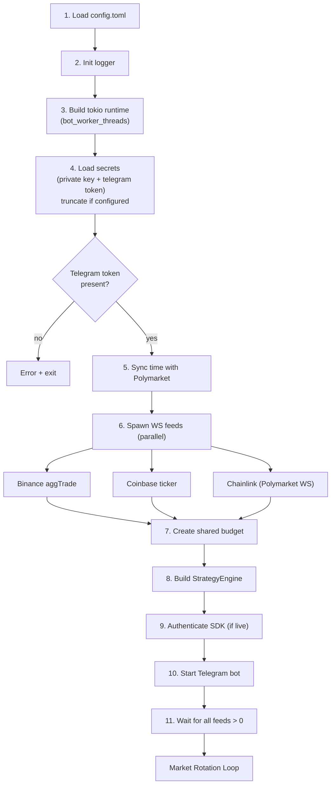
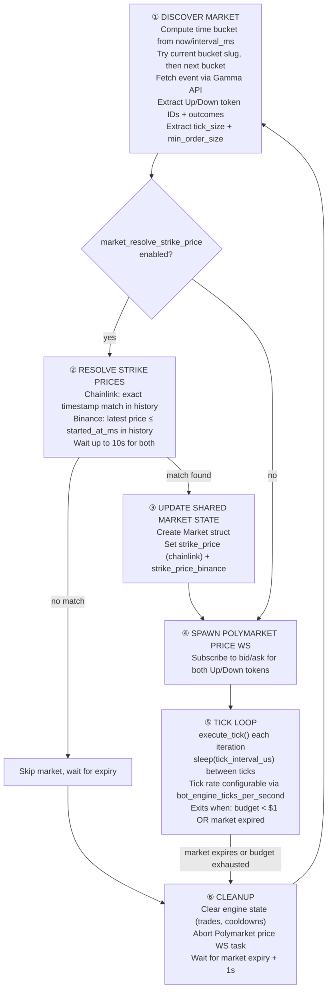
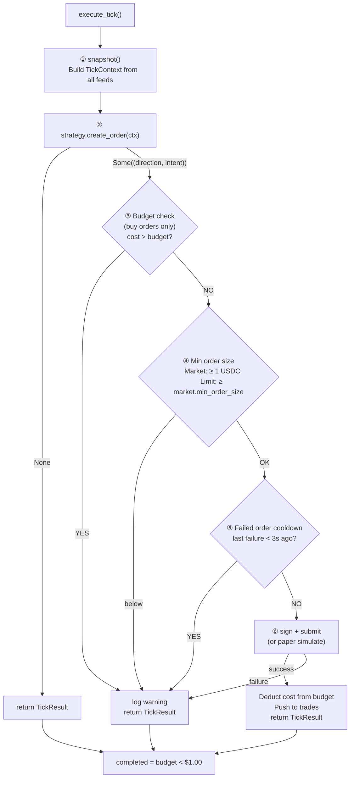

# Workflow

## Startup (main.rs)

1. Load `config.toml` — flat config, validate all fields
2. Init logger with `bot_name` and `logger_level`
3. Build tokio runtime with configurable `bot_worker_threads` (default 2)
4. Load secrets from files: polygon private key + telegram bot token
   - If `truncate_secret_files = true`, files are emptied after reading
   - If telegram token is missing → error + exit
   - If private key is missing → PAPER mode (no real trades)
5. Sync server time offset with Polymarket CLOB
6. Spawn 3 WebSocket feed tasks (all concurrent):
   - **Binance** — `aggTrade` stream → `binance_tx` + `binance_history` (primary price oracle)
   - **Coinbase** — `ticker` stream → `coinbase_tx` (secondary oracle)
   - **Chainlink** — Polymarket live-data WS → `chainlink_tx` + `chainlink_history` (settlement oracle)
7. Create shared budget (`Arc<Mutex<f64>>` from `bot_initial_budget`)
8. Build `StrategyEngine` with chosen strategy (`engine_strategy`) and shared budget
9. Authenticate Polymarket SDK (if private key present → live mode)
10. Start Telegram bot on dedicated thread — register commands, sync menu
11. Wait for all feeds (Binance, Coinbase, Chainlink > 0) before entering main loop



## Market Rotation Loop



## Tick Loop (`execute_tick`)



Key behavioral notes:
- The engine tracks budget and marks `completed = true` when budget drops below $1.00
- Failed orders trigger a 3-second cooldown before the next attempt
- The strategy is stateless per tick — it decides whether to place an order each tick

## Strategy Trait

Strategies implement the `Strategy` trait:

```rust
trait Strategy {
    /// Called each tick. Return Some((direction, intent)) to place an order.
    fn create_order(&self, ctx: &TickContext)
        -> Option<(TokenDirection, OrderIntent)>;
}
```

**TickContext** provides:
- `binance_price`, `binance_ts` — Binance spot price + timestamp (ms)
- `coinbase_price`, `coinbase_ts` — Coinbase spot price + timestamp (ms)
- `chainlink_price`, `chainlink_ts` — Chainlink oracle price + timestamp (ms)
- `polymarket_now_ms` — current time adjusted for Polymarket server offset (ms)
- `market` — `Option<Arc<Market>>` with live bid/ask prices
- `binance_history`, `chainlink_history` — `Arc<Mutex<VecDeque<(f64, i64)>>>` price histories
- `trades` — `Vec<Trade>` of all trades placed during this market

**OrderIntent**: `Limit { side, price, size, order_type }` or `Market { side, amount, order_type }`.

The engine handles all infrastructure: order signing, budget tracking,
min-size validation, cooldowns, and Telegram alerts. The strategy only decides
*when* to trade and *what order* to place.

## Bono Strategy

Entry-only strategy:

1. Wait until market is within 30 seconds of expiry (`time_to_expire_ms() <= 30_000`)
2. Check both Up and Down ask prices are > 0
3. Buy whichever side has the higher ask price
4. Only if the ask price is between 0.85 and 0.97 (exclusive/inclusive)
5. Place a FOK market order for $1.00 USDC at that price
6. Engine deducts cost from budget; marks completed if budget < $1

## Konzerva Strategy

Placeholder strategy — always returns `None` (no orders placed). Useful for testing infrastructure without trading.

## Order Execution

### try_order (engine)

1. **Budget check** (buy orders only): if order cost > remaining budget → skip with warning
2. **Min order size**: Market orders require ≥ 1 USDC; Limit orders require ≥ `market.min_order_size`
3. **Cooldown**: If last order failed < 3s ago → skip
4. **Live mode**: Signs order via Polymarket SDK → submits to CLOB. On failure → sets cooldown timestamp, returns None.
5. **Paper mode**: Simulates a fill using best ask price. No on-chain interaction.
6. **Fill resolution**: For matched market orders, actual fill price/size is computed from the CLOB response's `making_amount` / `taking_amount`.
7. **Budget deduction**: On successful trade, cost is deducted from shared budget. Buy cost = USDC spent; sell cost = 0.

### sign_and_submit (engine)

Handles both Limit and Market order types via SDK builder pattern:
- **Limit**: `client.limit_order().order_type().token_id().side().price().size().build()`
- **Market**: `client.market_order().order_type().token_id().side().amount().build()` — amount is `Amount::usdc` for buys, `Amount::shares` for sells
- SDK auto-validates tick size and fetches neg_risk
- Signs with wallet private key (Polygon chain)
- Posts to Polymarket CLOB
- Handles response status: `Matched` (filled), `Delayed` (matching delay), `Unmatched` (no fill), `Live` (resting)
- Stores the `OrderStatusType` from the CLOB response in the returned `Trade.order_status` field (paper mode defaults to `Matched`)

## Market Discovery

On startup (and after each market expires):

1. Computes current time bucket: `(now_ms / interval_ms) * interval_ms`
2. Checks two slugs: current bucket and next bucket (e.g. `btc-updown-5m-1710000`)
3. Fetches market metadata from Polymarket Gamma API (`event_by_slug`)
4. Extracts Up/Down token IDs from market outcomes (matches "UP"/"YES" and "DOWN"/"NO")
5. Extracts `tick_size` and `min_order_size` from Gamma market metadata
6. Creates `Market` struct with both token sides
7. If `market_resolve_strike_price` is enabled:
   - Looks up chainlink strike from history (exact timestamp match with `started_at_ms`)
   - Looks up binance strike from history (latest price at or before `started_at_ms`)
   - Waits up to 10s for both; skips market if not found
8. Subscribes to Polymarket price WebSocket for both tokens

## Data Feeds

| Feed | Source | Channel Type | History | Reconnect |
|------|--------|-------------|---------|-----------|
| Binance price | `aggTrade` WS | `watch<(f64, i64)>` | VecDeque (configurable max) | Exponential backoff 5s–60s |
| Coinbase price | `ticker` WS | `watch<(f64, i64)>` | None | Exponential backoff 5s–60s |
| Chainlink price | Polymarket live-data WS | `watch<(f64, i64)>` | VecDeque (interval_mins * 60 + 5) | Exponential backoff 5s–60s |
| Polymarket prices | SDK `subscribe_prices` | `Arc<Mutex<Option<Arc<Market>>>>` | None | 5s on subscribe error, 2s on stream error |

Backoff formula: `min(5 * 2^attempt, 60)` seconds.

## Polymarket Price Updates

The price WS updates incoming bid/ask directly:
- Price must be > 0
- Token must belong to current market (up or down)
- Timestamp is converted to milliseconds (`timestamp * 1000`)

## Telegram Integration

The Telegram bot runs on a **dedicated OS thread** with its own single-threaded tokio runtime, fully isolated from the main engine runtime. Only messages from the configured `bot_telegram_chat_id` are processed — all others are silently ignored.

### Architecture
- **Outbound**: Messages sent via `Telegram.send()` → unbounded mpsc channel → outbound loop with 3 retry attempts (MarkdownV2 format)
- **Inbound**: Long-polling loop (`getUpdates`) → owner-only filtering by `bot_telegram_chat_id` → command dispatch
- **Commands**: Simple routing (`/command`) with auto-synced bot menu

### Registered Commands
- `/budget [amount]` — Query or set the bot's USDC budget at runtime

## Config Structure

Flat TOML file with prefixed keys — no nested sections:

```toml
# Security
truncate_secret_files = true              # Empty secret files after reading (default: true)
bot_polygon_private_key_file = ".key"     # Polygon wallet key file (missing = PAPER mode)
bot_telegram_bot_token_file = ".tg-token" # Telegram bot token file (required)

# Bot
bot_name = "bono"                         # Bot instance name (required)
bot_initial_budget = 4.00                 # USDC budget per instance
bot_telegram_chat_id = 8289100643         # Owner's Telegram chat ID (required)
bot_worker_threads = 2                    # Tokio runtime worker threads (1–16)
bot_engine_ticks_per_second = 1000        # Trading loop tick rate

# Engine
engine_strategy = "bono"                  # Trading strategy: bono, konzerva (required)

# Market
market_asset = "btc"                      # btc/eth/sol/xrp
market_interval_minutes = 5              # 5 or 15
market_resolve_strike_price = true        # Wait for strike before trading

# Logger
logger_level = "info"                     # error/warn/info/debug/trace

# Feeds
# feeds_binance_history_secs = 300        # Rolling history window (default: interval * 60)
# feeds_chainlink_history_secs = 300
```

## Graceful Shutdown

The bot listens for SIGINT (Ctrl+C) and SIGTERM via `tokio::select!`. Either signal cleanly exits the main loop. The market rotation loop and all spawned WS tasks are dropped on shutdown.
