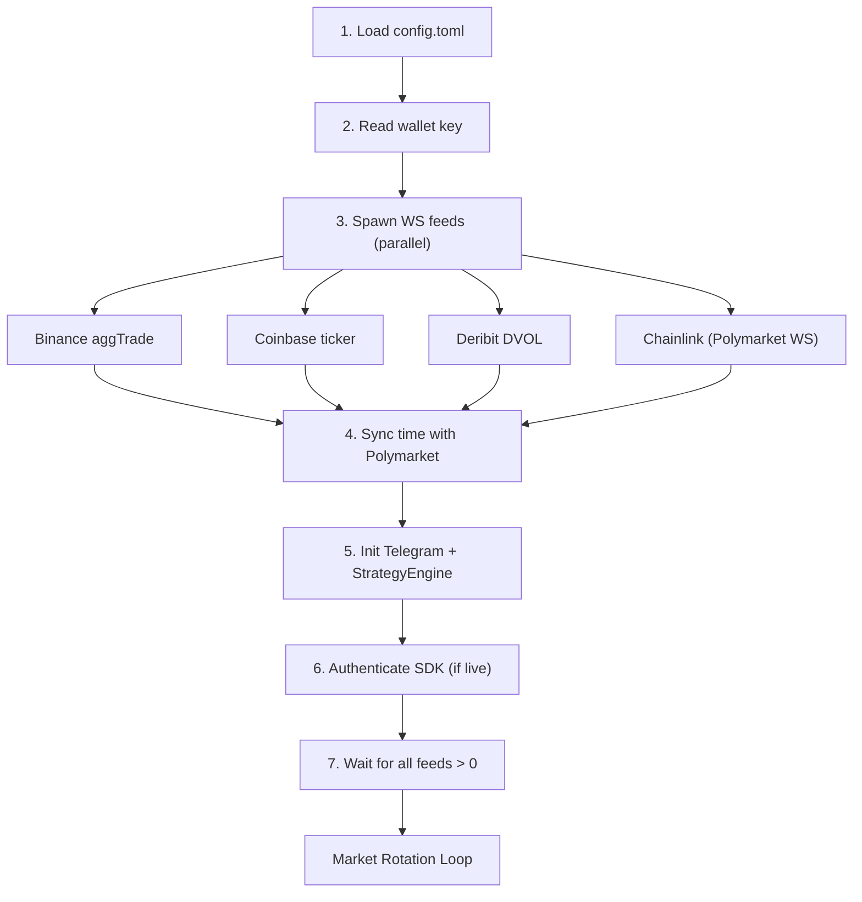
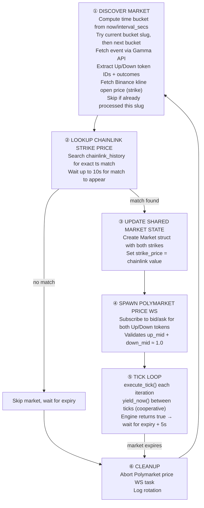
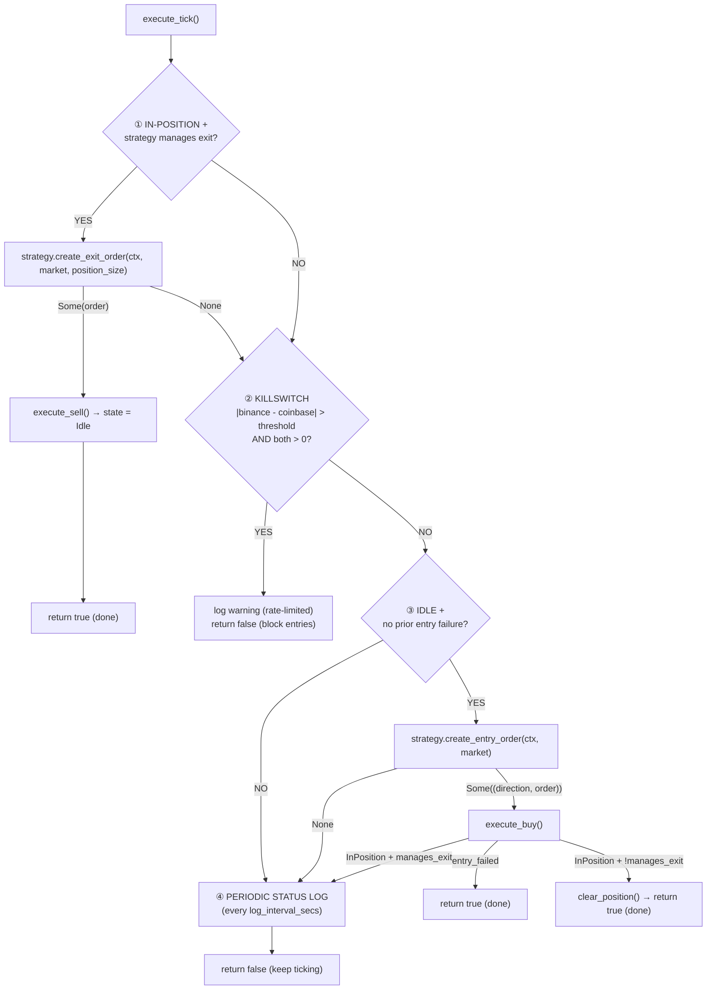
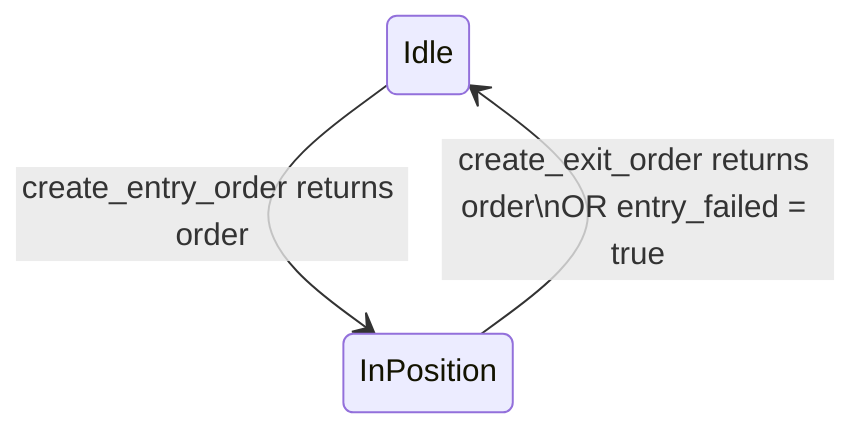

# Workflow

## Startup (bot.rs)

1. Load `config.toml` — validate asset (btc/eth/sol/xrp) and interval (5/15)
2. Read wallet private key from key file (if exists)
3. Spawn 4 WebSocket feed tasks (all concurrent):
   - **Binance** — `aggTrade` stream → `binance_tx` + `binance_history` (primary price oracle)
   - **Coinbase** — `ticker` stream → `coinbase_tx` (secondary oracle)
   - **Deribit** — DVOL index → `dvol_tx` (implied volatility)
   - **Chainlink** — Polymarket live-data WS → `chainlink_tx` + `chainlink_history` (settlement oracle)
4. Sync server time offset with Polymarket CLOB
5. Init Telegram, build `StrategyEngine` with chosen strategy (e.g. `BonoStrategy`)
6. Authenticate Polymarket SDK (if private key present → live mode). Heartbeat background task auto-starts on auth — keeps resting orders alive for future GTC/GTD strategies.
7. Wait for all feeds (Binance, Coinbase, Chainlink, DVOL > 0) before entering main loop



## Market Rotation Loop



## Tick Loop (`execute_tick` — every yield)



Key behavioral notes:
- Exit checks run **before** killswitch — positions can be closed even during exchange divergence
- Killswitch only blocks **new entries**, not exits
- `entry_failed = true` is a terminal state for the current market — engine won't retry
- Entry-only strategies (manages_exit = false) complete immediately after buy

## Strategy Trait

Strategies implement the `Strategy` trait:

```rust
trait Strategy {
    // Called each tick when idle. Return Some((direction, order)) to buy.
    fn create_entry_order(&self, ctx: &TickContext, market: &Market)
        -> Option<(TokenDirection, OrderParams)>;

    // Called each tick while holding a position.
    // Return Some(OrderParams) to sell, None to keep holding.
    fn create_exit_order(&self, ctx: &TickContext, market: &Market, position_size: f64)
        -> Option<OrderParams> { None }

    // Whether this strategy manages its own exit logic.
    // If false, the engine considers itself done immediately after entry.
    fn manages_exit(&self) -> bool { false }
}
```

**TickContext** provides:
- `binance_price`, `binance_ts` — Binance spot price + timestamp (ms)
- `coinbase_price`, `coinbase_ts` — Coinbase spot price + timestamp (ms)
- `chainlink_price`, `chainlink_ts` — Chainlink oracle price + timestamp (ms)
- `dvol` — Deribit implied volatility index
- `now_ms` — current time adjusted for Polymarket server offset (ms)
- `binance_history`, `chainlink_history` — Arc<Mutex<VecDeque<(f64, i64)>>> price histories

**OrderParams**: `Limit { price, size }` or `Market { amount, price, order_type }`.

The engine handles all infrastructure: state machine, order signing,
killswitch, logging, and Telegram alerts. The strategy only decides
*when* to trade and *what order* to place.

## Bono Strategy

Entry-only strategy (`manages_exit = false`):

1. Wait `delay_secs` (default 10s) after market start
2. Check both Up and Down ask prices are > 0
3. Buy whichever side has the higher ask price
4. Place a FOK market order for $1.00 at that price
5. Engine marks done immediately after buy (no exit management)

Config: `delay_secs`, `budget` (budget currently unused in entry logic, hardcoded $1.00 amount).

## State Machine



- **Idle** — No position. Engine calls `create_entry_order` on the current market.
- **InPosition** — Holding shares. Engine calls `create_exit_order` each tick (if manages_exit).

## Order Execution

### execute_buy (engine)

- **Live mode**: Signs order via Polymarket SDK → submits to CLOB. On success → InPosition. On failure → `entry_failed = true`.
- **Sim mode**: Immediately sets InPosition with the order's price/size. No on-chain interaction.
- Sends Telegram alert on successful entry.

### execute_sell (engine)

- **Live mode**: Signs order → submits. On success → Idle + PnL logged. On failure → stays InPosition.
- **Sim mode**: Calculates PnL from entry price, resets to Idle.

### Pre-submission validation (engine)

- Checks order size against market's `min_order_size` (from Gamma API). Orders below minimum are skipped with a warning.

### sign_and_submit (engine)

Handles both Limit and Market order types:
- Converts price/size to `Decimal` (2 decimal places for limit, 4 for market price)
- Validates amounts > 0 before submission
- Builds the order via SDK builder pattern (SDK auto-validates tick size and fetches neg_risk)
- Signs with wallet private key (Polygon chain)
- Posts to Polymarket CLOB
- Handles response status: `Matched` (filled), `Delayed` (matching delay), `Unmatched` (no fill), `Live` (resting)
- Stores the `OrderStatusType` from the CLOB response in the returned `Trade.order_status` field (paper mode defaults to `Matched`)

### Heartbeat (SDK auto-managed)

When the `heartbeats` SDK feature is enabled, the SDK automatically starts a background task on authentication that sends periodic heartbeat signals to the CLOB (`POST /heartbeats`). This prevents automatic cancellation of resting orders (GTC/GTD). The current Bono strategy uses FOK orders only, but future strategies using limit orders will benefit from this. The heartbeat interval is configurable via `ClobConfig` (default 5s).

## Market Discovery

On startup (and after each market expires):

1. Computes current time bucket: `(now / interval_secs) * interval_secs`
2. Checks two slugs: current bucket and next bucket (e.g. `btc-updown-5m-1710000000`)
3. Fetches market metadata from Polymarket Gamma API (`event_by_slug`)
4. Extracts Up/Down token IDs from market outcomes (matches "UP"/"YES" and "DOWN"/"NO")
5. Extracts `tick_size` and `min_order_size` from Gamma market metadata
6. Fetches strike price from Binance kline API (candle open price at bucket start)
7. Looks up chainlink strike price from history (exact timestamp match with `started_ms`)
8. Creates `Market` struct in `shared_market` with both strike prices, tick_size, and min_order_size
9. Subscribes to Polymarket price WebSocket for both tokens

## Data Feeds

| Feed | Source | Channel Type | History | Reconnect |
|------|--------|-------------|---------|-----------|
| Binance price | `aggTrade` WS | `watch<(f64, i64)>` | VecDeque (configurable max) | Exponential backoff 5s–60s |
| Coinbase price | `ticker` WS | `watch<(f64, i64)>` | None | Exponential backoff 5s–60s |
| Chainlink price | Polymarket live-data WS | `watch<(f64, i64)>` | VecDeque (interval_mins * 60 + 5) | Exponential backoff 5s–60s |
| Deribit DVOL | `deribit_volatility_index` WS | `watch<f64>` | None | Exponential backoff 5s–60s |
| Polymarket prices | SDK `subscribe_prices` | `Arc<Mutex<Option<Market>>>` | None | Fixed 5s then 2s retry |

Backoff formula: `min(5 * 2^attempt, 60)` seconds.

## Polymarket Price Validation

The price WS validates incoming bid/ask updates:
- Both bid and ask must be > 0
- Token must belong to current market (up or down)
- `up_mid + down_mid` must be between 0.9 and 1.1 (skip validation if either side uninitialized)

## Config Structure

```toml
log_level = "info"           # error/warn/info/debug/trace

[wallet]
key_file = ".key"            # Path to Polygon private key file
                             # Key present → LIVE mode, absent → PAPER mode

[market]
asset = "btc"                # btc/eth/sol/xrp
interval_minutes = 5         # 5 or 15

[engine]
exchange_price_divergence_threshold = 50.0  # Killswitch threshold ($)
log_interval_secs = 0.5                     # Min seconds between status logs

[strategy.bono]
delay_secs = 10.0            # Seconds after market start before entry
budget = 3.0                 # USDC budget per trade

[telegram]
bot_token = ""               # Telegram bot token
chat_id = ""                 # Telegram chat ID
```

## Graceful Shutdown

The bot listens for SIGINT (Ctrl+C) and SIGTERM via `tokio::select!`. Either signal cleanly exits the main loop. The market rotation loop and all spawned WS tasks are dropped on shutdown.
